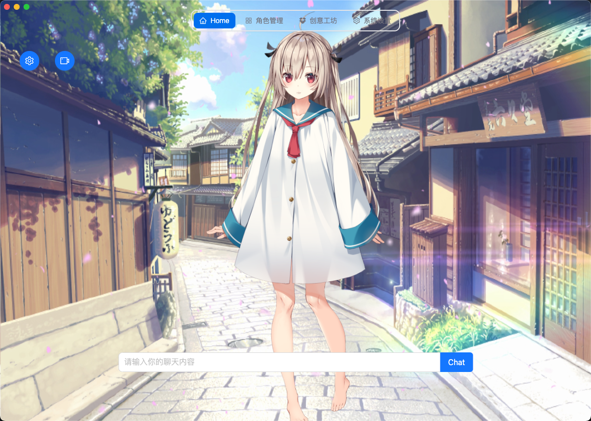

# VTube-Sama

> An AI-powered virtual YouTuber (VTuber) application with extremely low barrier to entry

VTube-Sama is a comprehensive AI VTuber solution that enables users to create and interact with AI-driven virtual characters. It supports multiple LLM providers, Live2D animations, live streaming integration, and cross-platform desktop deployment.



## ✨ Features

- 🤖 **Multi-LLM Support**: OpenAI, Ollama, ZhiPu (CharGLM) integration
- 🎭 **Live2D Animation**: Real-time character display with lip-sync and expressions
- 📺 **Live Streaming**: Bilibili platform integration
- 🎤 **Voice Processing**: Text-to-speech and voice recognition
- 🎮 **Game Integration**: Mod support for games like Subnautica
- 💻 **Cross-Platform**: Mac and Windows desktop support
- 🎨 **Character Management**: Create and customize virtual characters

## 🏗️ Architecture

```
├── binary/          # Vision processing module
├── gui/             # Main Electron application
├── mods/            # Game integration modules
│   └── Subnautica/  # Subnautica game mod support
└── scripts/         # Build and utility scripts
```

## 🚀 Quick Start

### Prerequisites

- Node.js >= 14.x
- Yarn package manager

### Installation

```bash
# Clone the repository
git clone https://github.com/Westworld-AI/VTube-Sama-App
cd VTube-Sama-App

# Install dependencies
cd gui
yarn install
```

### Development

```bash
# Start development server
yarn start
```

### Building

```bash
# Package for current platform
yarn package

# Package for Windows
yarn package-win
```

## 🛠️ Technology Stack

- **Frontend**: Electron + React 18 + TypeScript
- **UI**: NextUI, Ant Design, Tailwind CSS
- **Animation**: Live2D with PIXI.js
- **Database**: SQLite + TypeORM
- **AI**: OpenAI, Ollama, ZhiPu APIs
- **Voice**: Microsoft Edge TTS, Vosk Speech Recognition
- **Streaming**: Bilibili Live API